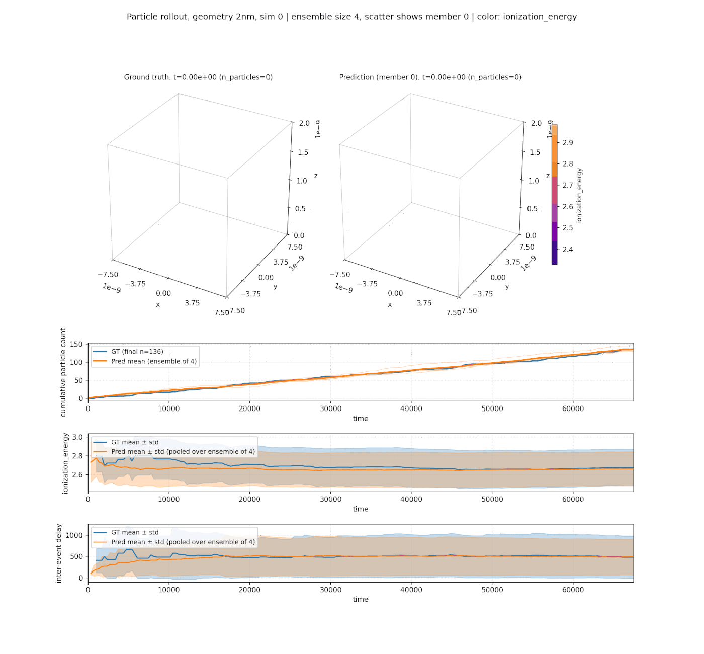

<!-- markdownlint-disable -->
# Probabilistic Surrogate for Kinetic Monte Carlo Solvers

## Problem Overview

[Kinetic Monte Carlo (KMC)](https://en.wikipedia.org/wiki/Kinetic_Monte_Carlo)
is a family of stochastic simulation methods that evolve a system as a sequence
of discrete events. From the current state, the solver enumerates the $M$
events that could fire next, each with a rate $r_i \ge 0$ (its probability per
unit time). It selects one event $i$ in proportion to its rate and advances a
physical clock by a stochastic inter-event time $\Delta t$:

$$
p_i = \frac{r_i}{R}, \qquad R = \sum_{j=1}^{M} r_j, \qquad
\Delta t \sim \mathrm{Exponential}(R).
$$

Here $R$ is the system's total rate. Event $i$ is drawn with probability $p_i$,
and the wait until it fires is exponential with mean $\mathbb{E}[\Delta t] =
1/R$: the more (and faster) the available events, the shorter the typical step.
Repeating this produces a trajectory: a time-ordered sequence of events, each
adding, moving, or transforming an entity in the system. KMC underpins a wide
range of applications, including:

- Materials science: defect kinetics, vacancy and interstitial migration,
  precipitation, and radiation damage.
- Semiconductor reliability: progressive build-up of traps/defects under
  electrical and thermal stress.
- Surface science and catalysis: adsorption, desorption, diffusion, and
  reaction events on a substrate.
- Epitaxial and thin-film growth, electrochemistry, and grain-boundary
  evolution.

KMC is accurate but expensive: reaching a physically relevant time often
requires very long event chains, and each event requires re-evaluating a large
set of candidate rates. This makes long-horizon studies and uncertainty
quantification costly.

This example trains a **probabilistic autoregressive surrogate** that emulates
a KMC solver one event at a time. The surrogate is general purpose: it makes no
assumption about the underlying physics beyond the structure of an event
stream. We use the generic term **particle** for the entities created by the
solver (defects, adatoms, traps, nucleated grains, ...), but the code is
agnostic to what a particle represents.

At step $n$ the surrogate maps the current state to the **next event** the
solver would produce. Its inputs are:

- the **particle population**: each particle's coordinates $(x, y, z)$, scalar
  features $X_p$, and the delay since the previous event;
- the current simulation **time** $t_n$;
- a static background **mesh** describing the geometry the events unfold in: a
  point cloud with coordinates $(x_m, y_m, z_m)$ and scalar fields $X_m$ (e.g. a
  temperature or potential map encoding the boundary/initial conditions). As
  shipped, the mesh is a **required** input (the datapipe expects a `maps/` file
  per simulation); a mesh-free variant is a natural extension but is not
  currently supported.

It predicts the **next event**:

- the **new particle's features** $(x, y, z, X_p)$;
- the **inter-event delay** $\Delta t$, a stochastic function of the whole input
  state, $\Delta t = \Delta t(t_n, \{x, y, z, X_p\}, X_m)$, which advances the
  clock to $t_{n+1} = t_n + \Delta t$.

Feeding each predicted event back in rolls out a trajectory autoregressively;
because the prediction is probabilistic, many rollouts from the same initial
state form an **ensemble** that quantifies its uncertainty.

<p align="center">
  
</p>

**Scope and assumptions.** The only event type currently modeled is *particle
birth*: each event adds one new particle to the population. Existing particles
do not move, change their features, or disappear. The formulation extends
naturally to richer events (particle migration/diffusion, feature mutation, or
particle death), which are not implemented in this example.

The default model (`utils.nn.ParticleGeoTransolver`) is a geometry-aware
attention network that consumes the particle population (and the mesh, when
provided) and predicts the next event.

## Prerequisites

Install PhysicsNeMo (if not already installed) and copy this folder to a system
with a GPU available. Then install the additional dependencies:

```bash
pip install -r requirements.txt
```

This example is configured with [Hydra](https://hydra.cc/docs/intro/): the YAML
files under `conf/` hold the defaults, and any field can be overridden on the
command line. The workflow is:

1. [Dataset format](#dataset-format)
2. [Compute dataset statistics](#compute-dataset-statistics)
3. [Training](#training)
4. [Generation and rollout](#generation-and-rollout)

## Dataset format

This example does **not** ship a preprocessing pipeline: you are expected to
convert your KMC solver's raw output into the layout the datapipe
(`dataset.ParticlesDataset`) reads. That layout is:

```text
<data_dir>/
├── samples/
│   └── <geometry>/
│       └── sample_<sim>_<ts>.pth
├── maps/
│   └── <geometry>/
│       └── maps_<sim>.pth
└── stats.json
```

`<data_dir>` is any directory you choose; the datapipe reads the `samples/` and
`maps/` subtrees directly from it.

For a held-out evaluation split (training config `dataset.train_test_split:
true`), put the two splits in `train/` and `test/` subdirectories, each with the
same `samples/` and `maps/` layout:

```text
<data_dir>/
├── train/
│   ├── samples/
│   └── maps/
└── test/
    ├── samples/
    └── maps/
```

With `train_test_split: false` (the default) the datapipe reads `samples/` and
`maps/` directly under `<data_dir>`, with no `train/` / `test/` subdirectories.

- **`<geometry>`** is an arbitrary grouping directory. Use it to keep the
  simulations of one geometry (or one boundary-condition family) together. The
  names are auto-discovered and treated as opaque; the recipe attaches no
  physical meaning to them and pools every geometry into a single training set.
- **`<sim>`** is an integer simulation id (unique within a geometry group), and
  **`<ts>`** is the event index within that simulation.

**Sample files** `sample_<sim>_<ts>.pth` are dicts saved with `torch.save`:

| Key        | Type / shape                  | Meaning |
|------------|-------------------------------|---------|
| `features` | float tensor `(n, 3 + P + 1)` | The `n` particles present after event `ts`, in creation order. Columns are `[x, y, z, <P scalar features>, delay]`. |
| `time`     | float scalar                  | Absolute simulation time of the most recent event. |

The particle list is cumulative: `sample_<sim>_<ts>` contains the first `ts`
particles of simulation `<sim>`. The index runs from `0` (the initial state,
possibly empty) to `N` (the final event count). The trailing `delay` column is
the inter-event time between a particle's creation and the previous event.

**Maps files** `maps_<sim>.pth` describe the static background mesh of one
simulation:

| Key                | Type / shape           | Meaning |
|--------------------|------------------------|---------|
| `positions`        | float tensor `(N, 3)`  | Mesh point coordinates `(x, y, z)`. |
| `<mesh field name>`| float tensor `(N,)`    | One entry per configured mesh field (e.g. a temperature or potential map). |

**`stats.json`** holds per-quantity z-score statistics (produced by
`compute_stats.py`, see below). It must contain `coords`, `delay`, `log_delay`,
one entry per particle scalar feature, and one entry per mesh field. Each entry
is `{"mean": ..., "std": ...}`.

### Universal vs. configurable quantities

Some quantities exist in every KMC application and are handled with fixed column
positions:

- the first three particle and mesh columns are always the spatial coordinates
  `(x, y, z)`;
- the last particle column is always the inter-event `delay`;
- `time` is the absolute simulation clock.

The application-specific quantities are configured by name and must match the
keys in `stats.json` and the columns/keys in your data:

- `dataset.particle_feature_names`: the `P` scalar particle features, in the
  order they appear in the `features` columns (after `x, y, z`, before
  `delay`).
- `dataset.mesh_feature_names`: the `M` scalar mesh fields, in the order they
  are concatenated after `positions`.

For example, with `particle_feature_names: [energy]` and
`mesh_feature_names: [temperature, potential]`, each `features` row is
`[x, y, z, energy, delay]` and each maps file holds `positions`, `temperature`,
and `potential`.

### Coordinate units

Particle coordinates and mesh coordinates **must be provided in the same
physical unit**. The datapipe performs no unit conversion: the coordinates are
passed through as stored, and the model shares a single set of coordinate
statistics across particles and the mesh. If your raw data stores the two in
different units, convert them to a common unit in your preprocessing step.

## Compute dataset statistics

The datapipe z-scores every input with the statistics in `stats.json`.
`compute_stats.py` is configured from `conf/config_compute_stats.yaml`; compute
the statistics once over your dataset:

```bash
python compute_stats.py \
    dataset.data_dir=<path_to_data_dir> \
    dataset.particle_feature_names=[energy] \
    dataset.mesh_feature_names=[temperature,potential] \
    dataset.num_particles_max=<N> \
    compute.batch_size=512 compute.num_workers=4
```

This writes `<data_dir>/stats.json` (override `io.output_path` to write
elsewhere). The feature-name arguments and `dataset.num_particles_max` must
match the ones used for training; `num_particles_max` is the per-snapshot
particle cap and must be at least the largest particle count in your data. The
script supports distributed processing via `torch.distributed`; on a multi-GPU
machine run it with:

```bash
torchrun --standalone --nnodes=1 --nproc_per_node=<NUM_GPUS> compute_stats.py \
    dataset.data_dir=<path_to_data_dir> \
    dataset.particle_feature_names=[energy] \
    dataset.mesh_feature_names=[temperature,potential] \
    dataset.num_particles_max=<N>
```

## Training

Training is handled by `train.py`, configured from `conf/config_train.yaml`.
The model is trained with pure teacher forcing: at each step it is given the
ground-truth state at event `n` and regresses the ground-truth next event
(`n+1`), i.e. the inter-event delay and the new particle's features. The config
lets you change the model and its inputs, the dataset, the loss and
regularization, and the training schedule; each field is documented inline in
`conf/config_train.yaml`.

To train with a specific dataset:

```bash
python train.py \
    dataset.data_dir=<path_to_data_dir> \
    dataset.stats_file=<path_to_data_dir>/stats.json \
    dataset.particle_feature_names=[energy] \
    dataset.mesh_feature_names=[temperature,potential] \
    model.num_particles_max=<N> \
    training.batch_size_per_gpu=64
```

`model.num_particles_max` is required (the per-snapshot particle cap, at least
the largest particle count in your data). Any field can be overridden either on
the command line (as above) or by editing `conf/config_train.yaml`. The model's
particle/mesh feature counts are derived automatically from the feature-name
lists.

On a single node with multiple GPUs, run with Distributed Data Parallel (DDP):

```bash
torchrun --standalone --nnodes=1 --nproc_per_node=<NUM_GPUS> train.py \
    dataset.data_dir=<path_to_data_dir> \
    dataset.stats_file=<path_to_data_dir>/stats.json \
    training.batch_size_per_gpu=64
```

For multi-node training, refer to the
[torchrun documentation](https://docs.pytorch.org/docs/stable/elastic/run.html).

The training script produces:

- Console / `./outputs` logs with the training loss and its components, plus
  gradient-norm and throughput statistics.
- Checkpoints under `io.checkpoint_dir`, containing the trained model and the
  optimizer / scheduler state for resuming (`io.load_checkpoint=true`).

## Generation and rollout

After training, `generate.py` (configured from `conf/config_generate.yaml`)
generates trajectories from a checkpoint for the simulations you select. Its
defining capability is **ensemble generation**: from one initial state it draws
`rollout.num_ensemble` independent trajectories, turning a single point
prediction into a distribution over plausible futures with per-event
uncertainty. This makes the surrogate useful for uncertainty quantification and
for studying the spread of outcomes a stochastic KMC process can produce.

```bash
python generate.py \
    checkpoint=<path_to_checkpoint.mdlus> \
    dataset.data_dir=<path_to_data_dir> \
    dataset.stats_file=<path_to_data_dir>/stats.json \
    dataset.particle_feature_names=[energy] \
    dataset.mesh_feature_names=[temperature,potential] \
    dataset.num_particles_max=<N> \
    rollout.num_ensemble=8
```

`rollout.simulations` is a list of `{geometry, sim_id}` entries selecting which
simulations to roll out; use `sim_id: "all"` to expand into every simulation of
a geometry group. Outputs are written to
`<io.output_dir>/<geometry>/rollout_sim<sim_id>.pth`, one file per simulation,
holding the ground-truth and ensemble trajectories plus the per-event predicted
distribution statistics in raw physical units.

The utilities under `utils/` consume these rollout files:
`plot_predictions.py` animates the predicted vs. ground-truth trajectory with
uncertainty bands, `plot_3d.py` renders the 3-D event scatter, and
`postprocess_predictions.py` aggregates ensemble statistics such as the time to
reach a given particle count.

